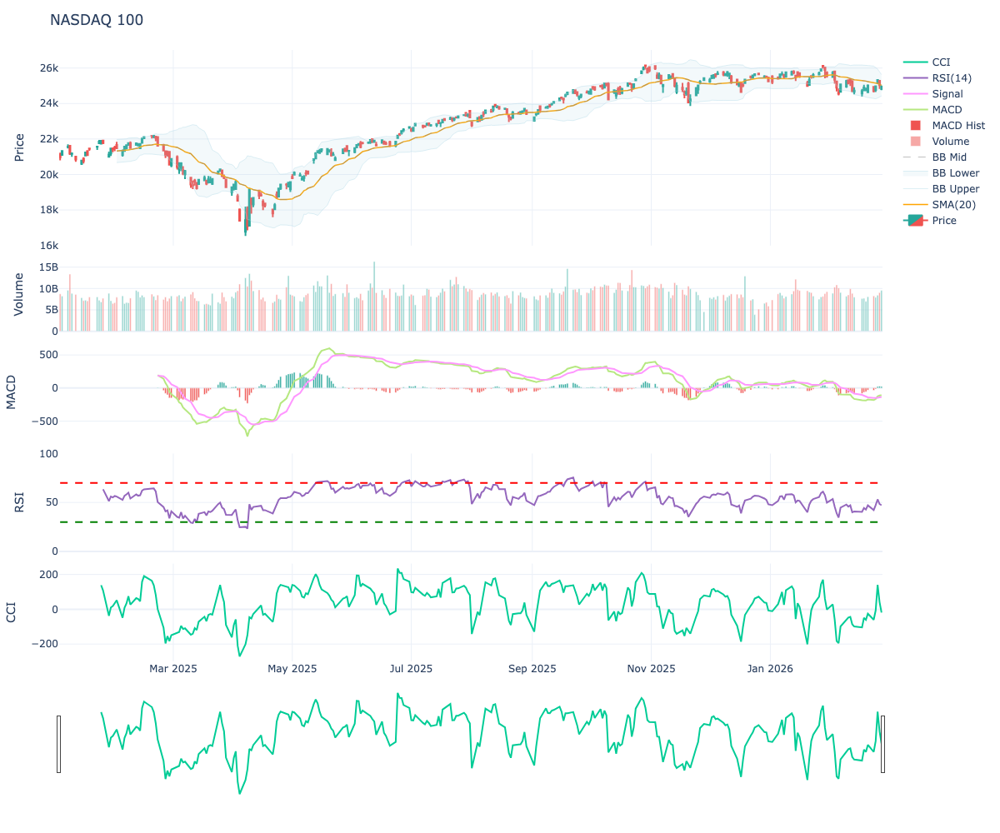

<div align="center">

# pytafast

[](https://pypi.org/project/pytafast/)
[](https://pypi.org/project/pytafast/)
[](https://codecov.io/gh/twn39/pytafast)
[](https://github.com/twn39/pytafast/blob/main/LICENSE)
[](https://pypi.org/project/pytafast/)
[](https://github.com/twn39/pytafast/actions)
[](https://twn39.github.io/pytafast/)
[](https://github.com/twn39/pytafast)

English | [中文](README_CN.md)

</div>

A high-performance Python wrapper for [TA-Lib](https://ta-lib.org/) and [R TTR](https://github.com/joshuaulrich/TTR) built with [nanobind](https://github.com/wjakob/nanobind). Provides **170+ technical analysis functions** with interactive plotting, pandas support, and async capabilities.

## Features

- 🚀 **High Performance** — C++ bindings via nanobind with GIL release for true parallelism.
- 📈 **R TTR Consistency** — Migrated 14+ R-native indicators (ALMA, ZigZag, GMMA, KST, etc.) with 100% numerical alignment.
- 📊 **Interactive Plotting** — Built-in `quantmod`-style visualization engine powered by Plotly.
- 🐼 **Pandas Native** — Seamless support for both `numpy.ndarray` and `pandas.Series` (preserves index).
- ⚡ **Async Support** — All functions available as async via `pytafast.aio`.
- 🔒 **GSL Powered Safety** — Uses Microsoft GSL (`gsl::span`) to prevent buffer overflows in C++.
- 📦 **Drop-in Replacement** — Same API as [ta-lib-python](https://github.com/TA-Lib-python).

### Plotting Preview



## Installation

```bash
pip install pytafast
```

### Optional Dependencies
```bash
# For static image export (PNG/PDF)
pip install kaleido
```

## Quick Start

### Interactive Plotting (quantmod style)

`pytafast` provides a powerful chaining API for professional financial charts:

```python
import pandas as pd
import pytafast

df = pd.read_csv("data.csv")

# Create a professional interactive chart in one chain
chart = (pytafast.Chart(df)
         .add_candlestick(name="NASDAQ 100")
         .add_sma(n=20, color='orange')
         .add_bbands(n=20)
         .add_zigzag(change=2.0)
         .add_patterns()  # Automatically label 60+ candlestick patterns
         .add_volume()
         .add_macd()
         .add_rsi())

chart.show()  # Opens interactive Plotly chart
chart.save_image("analysis.png")  # Saves as high-res static image
```

### R-native Indicator Computation

```python
import pytafast

# Arnaud Legoux Moving Average (ALMA) - superior smoothness
alma = pytafast.ALMA(close, timeperiod=9, offset=0.85, sigma=6.0)

# Zero Lag Exponential Moving Average (ZLEMA)
zlema = pytafast.ZLEMA(close, timeperiod=30)

# Chaikin Money Flow (CMF)
cmf = pytafast.CMF(high, low, close, volume, timeperiod=20)

# Know Sure Thing (KST)
kst, signal = pytafast.KST(close)
```

## Advanced Calculation Examples

### 1. Multi-MA Strategy Setup
```python
import pytafast
# Combine traditional MAs with high-performance R-style smoothers
df["sma"] = pytafast.SMA(df["close"], 20)
df["alma"] = pytafast.ALMA(df["close"], timeperiod=9, offset=0.85, sigma=6)
df["zlema"] = pytafast.ZLEMA(df["close"], 30)
```

### 2. Volatility & Squeeze Detection
```python
upper_bb, mid_bb, lower_bb = pytafast.BBANDS(df["close"], 20)
upper_kc, mid_kc, lower_kc = pytafast.keltnerChannels(df["high"], df["low"], df["close"], 20)
# Detect if Bollinger Bands are inside Keltner Channels (Squeeze)
df["squeeze"] = (upper_bb < upper_kc) & (lower_bb > lower_kc)
```

## Detailed Indicators Reference

> **Note:** All indicators support both `numpy.ndarray` and `pandas.Series` as input. When a Series is provided, metadata (index and name) is preserved.

### Overlap Studies

| Name | Signature | Description |
| :--- | :--- | :--- |
| **ALMA** | `(inReal, timeperiod=9, offset=0.85, sigma=6.0)` | Arnaud Legoux Moving Average. |
| **BBANDS** | `(inReal, timeperiod=5, nbdevup=2.0, nbdevdn=2.0, matype=MAType.SMA)` | Bollinger Bands. Returns: (upperband, middleband, lowerband) |
| **DEMA** | `(inReal, timeperiod=30)` | DEMA indicator. |
| **EMA** | `(inReal, timeperiod=30)` | EMA indicator. |
| **EVWMA** | `(inReal, inVolume, timeperiod=30)` | Elastic Volume Weighted Moving Average. |
| **HMA** | `(inReal, timeperiod=20)` | Hull Moving Average. |
| **KAMA** | `(inReal, timeperiod=30)` | KAMA indicator. |
| **MA** | `(inReal, timeperiod=30, matype=0)` | Moving Average (generic). |
| **MAMA** | `(inReal, fastlimit=0.5, slowlimit=0.05)` | MESA Adaptive Moving Average. Returns: (mama, fama) |
| **MIDPOINT** | `(inReal, timeperiod=14)` | MIDPOINT indicator. |
| **MIDPRICE** | `(inHigh, inLow, timeperiod=14)` | MIDPRICE indicator. |
| **SAR** | `(inHigh, inLow, acceleration=0.02, maximum=0.2)` | Parabolic SAR. |
| **SMA** | `(inReal, timeperiod=30)` | SMA indicator. |
| **T3** | `(inReal, timeperiod=5, vfactor=0.7)` | Triple Exponential Moving Average (T3). |
| **TEMA** | `(inReal, timeperiod=30)` | TEMA indicator. |
| **TRIMA** | `(inReal, timeperiod=30)` | TRIMA indicator. |
| **WMA** | `(inReal, timeperiod=30)` | WMA indicator. |
| **ZLEMA** | `(inReal, timeperiod=30)` | Zero Lag Exponential Moving Average. |


### Momentum Indicators

| Name | Signature | Description |
| :--- | :--- | :--- |
| **ADX** | `(inHigh, inLow, inClose, timeperiod=14)` | ADX indicator. |
| **ADXR** | `(inHigh, inLow, inClose, timeperiod=14)` | ADXR indicator. |
| **APO** | `(inReal, fastperiod=12, slowperiod=26, matype=0)` | Absolute Price Oscillator. |
| **AROON** | `(inHigh, inLow, timeperiod=14)` | Aroon. Returns: (aroondown, aroonup) |
| **AROONOSC** | `(inHigh, inLow, timeperiod=14)` | AROONOSC indicator. |
| **BOP** | `(inOpen, inHigh, inLow, inClose)` | Balance Of Power. |
| **CCI** | `(inHigh, inLow, inClose, timeperiod=14)` | CCI indicator. |
| **CMO** | `(inReal, timeperiod=14)` | CMO indicator. |
| **DX** | `(inHigh, inLow, inClose, timeperiod=14)` | DX indicator. |
| **KST** | `(inReal, nROC1=10, nROC2=15, nROC3=20, nROC4=30, nAvg1=10, nAvg2=10, nAvg3=10, nAvg4=15, nSig=9)` | Know Sure Thing (KST). Returns: (kst, signal) |
| **MACD** | `(inReal, fastperiod=12, slowperiod=26, signalperiod=9)` | Moving Average Convergence/Divergence. Returns: (macd, signal, hist) |
| **MACDEXT** | `(inReal, fastperiod=12, fastmatype=0, slowperiod=26, slowmatype=0, signalperiod=9, signalmatype=0)` | MACD with controllable MA type. |
| **MACDFIX** | `(inReal, signalperiod=9)` | MACD Fix 12/26. |
| **MFI** | `(inHigh, inLow, inClose, inVolume, timeperiod=14)` | Money Flow Index. |
| **MINUS_DI** | `(inHigh, inLow, inClose, timeperiod=14)` | MINUS_DI indicator. |
| **MINUS_DM** | `(inHigh, inLow, timeperiod=14)` | MINUS_DM indicator. |
| **MOM** | `(inReal, timeperiod=10)` | MOM indicator. |
| **PLUS_DI** | `(inHigh, inLow, inClose, timeperiod=14)` | PLUS_DI indicator. |
| **PLUS_DM** | `(inHigh, inLow, timeperiod=14)` | PLUS_DM indicator. |
| **PPO** | `(inReal, fastperiod=12, slowperiod=26, matype=0)` | Percentage Price Oscillator. |
| **ROC** | `(inReal, timeperiod=10)` | ROC indicator. |
| **ROCP** | `(inReal, timeperiod=10)` | ROCP indicator. |
| **ROCR** | `(inReal, timeperiod=10)` | ROCR indicator. |
| **ROCR100** | `(inReal, timeperiod=10)` | ROCR100 indicator. |
| **RSI** | `(inReal, timeperiod=14)` | RSI indicator. |
| **SMI** | `(inHigh, inLow, inClose, n=13, nFast=2, nSlow=25, nSig=9)` | Stochastic Momentum Index. Returns: (smi, signal) |
| **STOCH** | `(inHigh, inLow, inClose, fastk_period=5, slowk_period=3, slowk_matype=MAType.SMA, slowd_period=3, slowd_matype=MAType.SMA)` | Stochastic. Returns: (slowk, slowd) |
| **STOCHF** | `(inHigh, inLow, inClose, fastk_period=5, fastd_period=3, fastd_matype=0)` | Stochastic Fast. |
| **STOCHRSI** | `(inReal, timeperiod=14, fastk_period=5, fastd_period=3, fastd_matype=0)` | Stochastic RSI. |
| **TRIX** | `(inReal, timeperiod=30)` | TRIX indicator. |
| **ULTOSC** | `(inHigh, inLow, inClose, timeperiod1=7, timeperiod2=14, timeperiod3=28)` | Ultimate Oscillator. |
| **WILLR** | `(inHigh, inLow, inClose, timeperiod=14)` | WILLR indicator. |


### Volatility Indicators

| Name | Signature | Description |
| :--- | :--- | :--- |
| **ATR** | `(inHigh, inLow, inClose, timeperiod=14)` | ATR indicator. |
| **DonchianChannel** | `(inHigh, inLow, timeperiod=10)` | Donchian Channel. Returns: (upper, middle, lower) |
| **NATR** | `(inHigh, inLow, inClose, timeperiod=14)` | NATR indicator. |
| **STDDEV** | `(inReal, timeperiod=5, nbdev=1.0)` | Standard Deviation. |
| **TRANGE** | `(inHigh, inLow, inClose)` | True Range. |
| **keltnerChannels** | `(inHigh, inLow, inClose, timeperiod=20, atr_mult=2.0)` | Keltner Channels. Returns: (upper, middle, lower) |


### Volume Indicators

| Name | Signature | Description |
| :--- | :--- | :--- |
| **AD** | `(inHigh, inLow, inClose, inVolume)` | Chaikin A/D Line. |
| **ADOSC** | `(inHigh, inLow, inClose, inVolume, fastperiod=3, slowperiod=10)` | Chaikin A/D Oscillator. |
| **CMF** | `(inHigh, inLow, inClose, inVolume, timeperiod=20)` | Chaikin Money Flow. |
| **EMV** | `(inHigh, inLow, inVolume, timeperiod=9, vol_divisor=10000.0)` | Arms' Ease of Movement Value. Returns: (emv, smoothed_emv) |
| **OBV** | `(inReal0, inReal1)` | OBV indicator. |


### Price Transform

| Name | Signature | Description |
| :--- | :--- | :--- |
| **AVGPRICE** | `(inOpen, inHigh, inLow, inClose)` | Average Price. |
| **MEDPRICE** | `(inReal0, inReal1)` | MEDPRICE indicator. |
| **TYPPRICE** | `(inHigh, inLow, inClose)` | Typical Price. |
| **WCLPRICE** | `(inHigh, inLow, inClose)` | Weighted Close Price. |


### Cycle Indicators

| Name | Signature | Description |
| :--- | :--- | :--- |
| **HT_DCPERIOD** | `(inReal)` | HT_DCPERIOD indicator. |
| **HT_DCPHASE** | `(inReal)` | HT_DCPHASE indicator. |
| **HT_PHASOR** | `(inReal)` | Hilbert Transform - Phasor Components. |
| **HT_SINE** | `(inReal)` | Hilbert Transform - SineWave. |
| **HT_TRENDLINE** | `(inReal)` | HT_TRENDLINE indicator. |
| **HT_TRENDMODE** | `(inReal)` | HT_TRENDMODE indicator. |


### Statistics Functions

| Name | Signature | Description |
| :--- | :--- | :--- |
| **AVGDEV** | `(inReal, timeperiod=14)` | AVGDEV indicator. |
| **BETA** | `(inReal0, inReal1, timeperiod=5)` | BETA indicator. |
| **CORREL** | `(inReal0, inReal1, timeperiod=30)` | CORREL indicator. |
| **LINEARREG** | `(inReal, timeperiod=14)` | LINEARREG indicator. |
| **LINEARREG_ANGLE** | `(inReal, timeperiod=14)` | LINEARREG_ANGLE indicator. |
| **LINEARREG_INTERCEPT** | `(inReal, timeperiod=14)` | LINEARREG_INTERCEPT indicator. |
| **LINEARREG_SLOPE** | `(inReal, timeperiod=14)` | LINEARREG_SLOPE indicator. |
| **MAX** | `(inReal, timeperiod=30)` | MAX indicator. |
| **MIN** | `(inReal, timeperiod=30)` | MIN indicator. |
| **MINMAX** | `(inReal, timeperiod=30)` | Lowest and highest values over a specified period. |
| **MINMAXINDEX** | `(inReal, timeperiod=30)` | Indexes of lowest and highest values over a specified period. |
| **SUM** | `(inReal, timeperiod=30)` | SUM indicator. |
| **TSF** | `(inReal, timeperiod=14)` | TSF indicator. |
| **VAR** | `(inReal, timeperiod=5, nbdev=1.0)` | Variance. |


### Math Operators & Transforms

| Name | Signature | Description |
| :--- | :--- | :--- |
| **ACOS** | `(inReal)` | Vector ACOS. |
| **ADD** | `(inReal0, inReal1)` | ADD indicator. |
| **ASIN** | `(inReal)` | Vector ASIN. |
| **ATAN** | `(inReal)` | Vector ATAN. |
| **CEIL** | `(inReal)` | Vector CEIL. |
| **COS** | `(inReal)` | Vector COS. |
| **COSH** | `(inReal)` | Vector COSH. |
| **DIV** | `(inReal0, inReal1)` | DIV indicator. |
| **EXP** | `(inReal)` | Vector EXP. |
| **FLOOR** | `(inReal)` | Vector FLOOR. |
| **LN** | `(inReal)` | Vector LN. |
| **LOG10** | `(inReal)` | Vector LOG10. |
| **MULT** | `(inReal0, inReal1)` | MULT indicator. |
| **SIN** | `(inReal)` | Vector SIN. |
| **SINH** | `(inReal)` | Vector SINH. |
| **SQRT** | `(inReal)` | Vector SQRT. |
| **SUB** | `(inReal0, inReal1)` | SUB indicator. |
| **TAN** | `(inReal)` | Vector TAN. |
| **TANH** | `(inReal)` | Vector TANH. |


### Custom & R-Native

| Name | Signature | Description |
| :--- | :--- | :--- |
| **DPO** | `(inReal, timeperiod=10)` | Detrended Price Oscillator. |
| **GMMA** | `(inReal)` | Guppy Multiple Moving Average. Returns a tuple of 12 EMA series. |
| **SNR** | `(inHigh, inLow, inClose, timeperiod=14)` | Signal to Noise Ratio. |
| **VHF** | `(inReal, timeperiod=28)` | Vertical Horizontal Filter. |
| **ZIGZAG** | `(inHigh, inLow, change=10.0, percent=True)` | ZigZag indicator. |


### Candlestick Patterns

| Name | Signature | Description |
| :--- | :--- | :--- |
| **CDL2CROWS** | `(inOpen, inHigh, inLow, inClose)` | Candlestick Pattern: CDL2CROWS |
| **CDL3BLACKCROWS** | `(inOpen, inHigh, inLow, inClose)` | Candlestick Pattern: CDL3BLACKCROWS |
| **CDL3INSIDE** | `(inOpen, inHigh, inLow, inClose)` | Candlestick Pattern: CDL3INSIDE |
| **CDL3LINESTRIKE** | `(inOpen, inHigh, inLow, inClose)` | Candlestick Pattern: CDL3LINESTRIKE |
| **CDL3OUTSIDE** | `(inOpen, inHigh, inLow, inClose)` | Candlestick Pattern: CDL3OUTSIDE |
| **CDL3STARSINSOUTH** | `(inOpen, inHigh, inLow, inClose)` | Candlestick Pattern: CDL3STARSINSOUTH |
| **CDL3WHITESOLDIERS** | `(inOpen, inHigh, inLow, inClose)` | Candlestick Pattern: CDL3WHITESOLDIERS |
| **CDLABANDONEDBABY** | `(inOpen, inHigh, inLow, inClose, penetration=0.3)` | Candlestick Pattern: CDLABANDONEDBABY |
| **CDLADVANCEBLOCK** | `(inOpen, inHigh, inLow, inClose)` | Candlestick Pattern: CDLADVANCEBLOCK |
| **CDLBELTHOLD** | `(inOpen, inHigh, inLow, inClose)` | Candlestick Pattern: CDLBELTHOLD |
| **CDLBREAKAWAY** | `(inOpen, inHigh, inLow, inClose)` | Candlestick Pattern: CDLBREAKAWAY |
| **CDLCLOSINGMARUBOZU** | `(inOpen, inHigh, inLow, inClose)` | Candlestick Pattern: CDLCLOSINGMARUBOZU |
| **CDLCONCEALBABYSWALL** | `(inOpen, inHigh, inLow, inClose)` | Candlestick Pattern: CDLCONCEALBABYSWALL |
| **CDLCOUNTERATTACK** | `(inOpen, inHigh, inLow, inClose)` | Candlestick Pattern: CDLCOUNTERATTACK |
| **CDLDARKCLOUDCOVER** | `(inOpen, inHigh, inLow, inClose, penetration=0.5)` | Candlestick Pattern: CDLDARKCLOUDCOVER |
| **CDLDOJI** | `(inOpen, inHigh, inLow, inClose)` | Candlestick Pattern: CDLDOJI |
| **CDLDOJISTAR** | `(inOpen, inHigh, inLow, inClose)` | Candlestick Pattern: CDLDOJISTAR |
| **CDLDRAGONFLYDOJI** | `(inOpen, inHigh, inLow, inClose)` | Candlestick Pattern: CDLDRAGONFLYDOJI |
| **CDLENGULFING** | `(inOpen, inHigh, inLow, inClose)` | Candlestick Pattern: CDLENGULFING |
| **CDLEVENINGDOJISTAR** | `(inOpen, inHigh, inLow, inClose, penetration=0.3)` | Candlestick Pattern: CDLEVENINGDOJISTAR |
| **CDLEVENINGSTAR** | `(inOpen, inHigh, inLow, inClose, penetration=0.3)` | Candlestick Pattern: CDLEVENINGSTAR |
| **CDLGAPSIDESIDEWHITE** | `(inOpen, inHigh, inLow, inClose)` | Candlestick Pattern: CDLGAPSIDESIDEWHITE |
| **CDLGRAVESTONEDOJI** | `(inOpen, inHigh, inLow, inClose)` | Candlestick Pattern: CDLGRAVESTONEDOJI |
| **CDLHAMMER** | `(inOpen, inHigh, inLow, inClose)` | Candlestick Pattern: CDLHAMMER |
| **CDLHANGINGMAN** | `(inOpen, inHigh, inLow, inClose)` | Candlestick Pattern: CDLHANGINGMAN |
| **CDLHARAMI** | `(inOpen, inHigh, inLow, inClose)` | Candlestick Pattern: CDLHARAMI |
| **CDLHARAMICROSS** | `(inOpen, inHigh, inLow, inClose)` | Candlestick Pattern: CDLHARAMICROSS |
| **CDLHIGHWAVE** | `(inOpen, inHigh, inLow, inClose)` | Candlestick Pattern: CDLHIGHWAVE |
| **CDLHIKKAKE** | `(inOpen, inHigh, inLow, inClose)` | Candlestick Pattern: CDLHIKKAKE |
| **CDLHIKKAKEMOD** | `(inOpen, inHigh, inLow, inClose)` | Candlestick Pattern: CDLHIKKAKEMOD |
| **CDLHOMINGPIGEON** | `(inOpen, inHigh, inLow, inClose)` | Candlestick Pattern: CDLHOMINGPIGEON |
| **CDLIDENTICAL3CROWS** | `(inOpen, inHigh, inLow, inClose)` | Candlestick Pattern: CDLIDENTICAL3CROWS |
| **CDLINNECK** | `(inOpen, inHigh, inLow, inClose)` | Candlestick Pattern: CDLINNECK |
| **CDLINVERTEDHAMMER** | `(inOpen, inHigh, inLow, inClose)` | Candlestick Pattern: CDLINVERTEDHAMMER |
| **CDLKICKING** | `(inOpen, inHigh, inLow, inClose)` | Candlestick Pattern: CDLKICKING |
| **CDLKICKINGBYLENGTH** | `(inOpen, inHigh, inLow, inClose)` | Candlestick Pattern: CDLKICKINGBYLENGTH |
| **CDLLADDERBOTTOM** | `(inOpen, inHigh, inLow, inClose)` | Candlestick Pattern: CDLLADDERBOTTOM |
| **CDLLONGLEGGEDDOJI** | `(inOpen, inHigh, inLow, inClose)` | Candlestick Pattern: CDLLONGLEGGEDDOJI |
| **CDLLONGLINE** | `(inOpen, inHigh, inLow, inClose)` | Candlestick Pattern: CDLLONGLINE |
| **CDLMARUBOZU** | `(inOpen, inHigh, inLow, inClose)` | Candlestick Pattern: CDLMARUBOZU |
| **CDLMATCHINGLOW** | `(inOpen, inHigh, inLow, inClose)` | Candlestick Pattern: CDLMATCHINGLOW |
| **CDLMATHOLD** | `(inOpen, inHigh, inLow, inClose, penetration=0.5)` | Candlestick Pattern: CDLMATHOLD |
| **CDLMORNINGDOJISTAR** | `(inOpen, inHigh, inLow, inClose, penetration=0.3)` | Candlestick Pattern: CDLMORNINGDOJISTAR |
| **CDLMORNINGSTAR** | `(inOpen, inHigh, inLow, inClose, penetration=0.3)` | Candlestick Pattern: CDLMORNINGSTAR |
| **CDLONNECK** | `(inOpen, inHigh, inLow, inClose)` | Candlestick Pattern: CDLONNECK |
| **CDLPIERCING** | `(inOpen, inHigh, inLow, inClose)` | Candlestick Pattern: CDLPIERCING |
| **CDLRICKSHAWMAN** | `(inOpen, inHigh, inLow, inClose)` | Candlestick Pattern: CDLRICKSHAWMAN |
| **CDLRISEFALL3METHODS** | `(inOpen, inHigh, inLow, inClose)` | Candlestick Pattern: CDLRISEFALL3METHODS |
| **CDLSEPARATINGLINES** | `(inOpen, inHigh, inLow, inClose)` | Candlestick Pattern: CDLSEPARATINGLINES |
| **CDLSHOOTINGSTAR** | `(inOpen, inHigh, inLow, inClose)` | Candlestick Pattern: CDLSHOOTINGSTAR |
| **CDLSHORTLINE** | `(inOpen, inHigh, inLow, inClose)` | Candlestick Pattern: CDLSHORTLINE |
| **CDLSPINNINGTOP** | `(inOpen, inHigh, inLow, inClose)` | Candlestick Pattern: CDLSPINNINGTOP |
| **CDLSTALLEDPATTERN** | `(inOpen, inHigh, inLow, inClose)` | Candlestick Pattern: CDLSTALLEDPATTERN |
| **CDLSTICKSANDWICH** | `(inOpen, inHigh, inLow, inClose)` | Candlestick Pattern: CDLSTICKSANDWICH |
| **CDLTAKURI** | `(inOpen, inHigh, inLow, inClose)` | Candlestick Pattern: CDLTAKURI |
| **CDLTASUKIGAP** | `(inOpen, inHigh, inLow, inClose)` | Candlestick Pattern: CDLTASUKIGAP |
| **CDLTHRUSTING** | `(inOpen, inHigh, inLow, inClose)` | Candlestick Pattern: CDLTHRUSTING |
| **CDLTRISTAR** | `(inOpen, inHigh, inLow, inClose)` | Candlestick Pattern: CDLTRISTAR |
| **CDLUNIQUE3RIVER** | `(inOpen, inHigh, inLow, inClose)` | Candlestick Pattern: CDLUNIQUE3RIVER |
| **CDLUPSIDEGAP2CROWS** | `(inOpen, inHigh, inLow, inClose)` | Candlestick Pattern: CDLUPSIDEGAP2CROWS |
| **CDLXSIDEGAP3METHODS** | `(inOpen, inHigh, inLow, inClose)` | Candlestick Pattern: CDLXSIDEGAP3METHODS |

## Performance

pytafast achieves **superior throughput** via C++ GIL release. Scalability is near-linear with CPU cores.

| Multi-threaded (4 Threads) | Official Wrapper | pytafast | **Speedup** |
|:---|:---|:---|:---|
| **SMA** Concurrency | 20.1 ms | 6.3 ms | **3.15x** |
| **MACD** Concurrency | 75.0 ms | 20.7 ms | **3.62x** |

## Cross-Verification

We maintain a rigorous cross-verification suite against R `TTR`. You can run the numerical alignment report locally:

```bash
# Compare 150+ indicators against R TTR results
./scripts/run_comparison.sh data/berkshire_1y.csv
```
Detailed results are documented in [docs/comparison_report.md](docs/comparison_report.md).

## License

MIT License. Includes statically linked [TA-Lib](https://ta-lib.org/) (BSD).
Copyright (c) 1999-2026, Curry Tang & Mario Fortier.

# 跨平台技术指标算法差异对比报告 (Pytafast vs R TTR vs Mathematica)

本文档汇编整理了 `pytafast` (基于 TA-Lib C 标准库) 与 **R语言 (`TTR`/`quantmod` 包)** 以及 **Wolfram Mathematica (`FinancialIndicator`)** 之间，在计算常见技术指标时存在的错位和差异。

在量化金融中，这些计算差异**通常并不是代码编写上的 Bug**，而是由于不同平台的作者在数学基础定义、数据预热填充截断（Burn-in 期处理）或参数设定的平滑基准上的派系分歧造成的。

---

## 1. Pytafast (TA-Lib) vs R (TTR) 算法差异

在对底层 71 个核心指标进行严格的主力真实数据集交叉验证后，我们发现其中 61 个指标实现了 100% 完美的完全对齐（误差精度 `< 1e-7`），但有极少数指标因实现理念冲突出现了工程上不可调和的分歧：

### 1.1 `SAR` (抛物线转向指标) - 初始极值点检测差异
- **TA-Lib**：默认对整个时间序列使用 0.02 的恒定加速因子步长。在序列最开始，会向后回溯扫描一整段初始窗口，以严格锁定第一个绝对极端点 (EP)。
- **TTR**：首个 EP 锚点直接从最初出现的局部高点（上升趋势）或低点（下降趋势）开始确立，缺乏严格的多 K 线回溯预判。
- **状态总结**：导致整个抛物线因为缺乏回溯而发生 1-2 根 K 线的起始偏移，并在随后的递归计算中产生复利级错位发散（Max Diff 极高，完全对不上）。

### 1.2 `MACD` - 指数均线 (EMA) 缓冲期种子对齐差异
- **TA-Lib**：必须要求积累满 `timeperiod-1` 根有效 K 线，方可计算其 EMA 基础框架。同时强制通过延后计算快线 (12周期) 的基础种子来同步慢线 (26周期)。
- **TTR**：直接粗暴地从第 1 根 K 线开始分别独立计算快线和慢线的 EMA 衰减。
- **状态总结**：前期预热阶段（前约 30 根 K 线）会产生巨大的数值落差，因为虽然长期的衰减会使其趋同，但两条 EMA 前期的起跳期在数据空间上因对齐理念不同而处于严重错频状态。

### 1.3 `WILLR` (威廉指标) - 刻度映射倒置
- **TA-Lib / 原生算法**：忠实地输出标准数学边界范围，即 **-100 到 0** 之间。
- **TTR**：被强制规范化、正反倒置为一个严格的正数区间（**0 到 1**），在系统模型上完全颠倒了超买超卖的比例定义。
- **状态总结**：绝对值错位严重。这是一个纯架构设计上的倒错，核心其实无误。但如果双方针对最初期的 `NaN` 或零值预热区补齐操作出现极小偏差，整个序列便会相对错开 1 根对齐位。

### 1.4 `STDDEV` (标准差) - 统计学总体与样本偏差估算分歧
- **TA-Lib**：计算的是**总体标准差** (Population Standard Deviation)，即方差除以均值分母 `N`。
- **TTR**：调用底层 R 的基础统计库对象（默认 `sample=TRUE`），强制计算为带无偏估计的**样本标准差** (Sample Standard Deviation)，即方差除以 `N-1`。
- **状态总结**：两者之间产生无差别的横跨整张表段的绝对恒定比例差异（乘积偏移常系数必定为 `√(N/(N-1))`）。

### 1.5 `CMO` (钱德动量振荡器) - 公式平滑基准不符
- **TA-Lib**：严格按照 Wilder 的极早期绝对波动分发逻辑计算绝对归一化差分，结果尺度严格收敛于 -100 到 +100。
- **TTR**：这可能是实现代码的遗留问题，底层的 TTR 私自套用了一种经过不对称衰减过滤指数平滑的变动变体，导致计算产出规模从根本上脱离了标准框架。

### 1.6 `SMI` (随机动量指数) - 双重 EMA 种子机制偏差
- **TA-Lib (pytafast)**：遵循 Blau 的双重 EMA 严格标准。由于需要重复叠加并执行高层嵌套的 EMA 运算，算法针对最初那段连绵空白出现的 NaN 数据有极其特殊的继承清理设计。
- **TTR**：一旦存在 `EMA()` 内嵌迭代，其 `NA` 默认清洗序列的触发位会导致第二层平滑过滤的输入数据集出现首尾漂移偏差。这使得输入模型只要遇到空头开始阶段，初始计算便在不断偏离。

### 1.7 `CHV` (蔡金波动率) - 完全发散的非线性平滑互转
- **TA-Lib**：遵循其创立逻辑，默认在最高价与最低价 (High-Low) 的连续区间差分序列上执行一层固定周期的纯粹指数移动均线 (EMA)。
- **TTR**：该语言下的底层构建了独立的分离式滞后差分 (Lagging differences) 计算列组来负责整体平滑流程，这在数学模型上严重违背了经典的振幅测算初衷。

### 1.8 `ZigZag` (之字形转向) - 未来函数视角 (Lookahead)
- **TA-Lib**：采用极其苛刻的反因果逻辑 —— 每当价格向右侧实质性收线回调并彻底坐实了反转阈值之后，才容许事后回滚确认先前的峰谷节点。
- **TTR**：极大概率被允许使用了向右的未来函数透视（前瞻判断机制）。只要在同一个允许回撤的反转周期极高（低）区域内检测到了密集毛刺，两种探测准则（是否提前参考临近序列方向拐点）会锁定决然不同的坐标轴索引点位。（即使这样总体的大致匹配率也到达了 98% 左右）。

### 1.9 `KST` (确然指标) - 对 ROC 的错误内部降级
- **TTR**：虽然其暴露给外层的 `ROC()` 计算正常的百分比变动比率，但其 `KST` 实现底代码文件本身却因为某些过期的遗留依赖，错误或极其反常地越级调用了原生 `momentum()` —— 而这函数只产生未经除法的绝对价格间差值。因此这种由于原始参考库本身代码调用失误衍生的缺陷自然无法对接正统比例体系下的 `KST` 输出。

---

## 2. Pytafast (TA-Lib) vs Mathematica 算法差异

由于 Wolfram Mathematica 在进行量化金融衍生开发时将 `FinancialIndicator` 以及底层大量的基础运算和滑动过滤引擎黑盒处理，其默认的函数内部设定必然与开源体系（TA-Lib / Python 阵营）存在一定偏离：

| 指标 | 差异核心原因 | 详细说明 |
| :--- | :--- | :--- |
| **SMA** (简单移动平均) | **边缘预热动态填充区** | **TA-Lib** 的设计异常克制：只要前置天数不够周期，结果全部严谨返回 `NaN`。然而 **Mathematica** 为了追求数组能够立刻出图被强行抹平前置空窗，采取了自动动态减短计算周期的策略（前 3 天算不出可行的 5 日均线时，它直接变着法子分别算它当日截止的历史独立总有效均线），从而抹除预留缺失期。 |
| **MOM** (动量) | **差值距离 vs 百分比例** | **TA-Lib** 坚守着绝对的直面价差模型计算：$Close_t - Close_{t-N}$。**Mathematica** 则取巧将其演化表达为了乘号或比率乘积模式（可能隐式自带杠杆率）：$100 \times (Close_t / Close_{t-N})$。 |
| **CCI** (顺势指标) | **均值绝对偏差估算偏量** | **TA-Lib** 以极度标准的移动窗长 $N$ 作为常规偏量计算的分母并乘上名门特推的正态化常数 $0.015$。而由于 **Mathematica** 黑箱内对于绝对中值的提取可能内建了类似于求方差时的 $N-1$ 样本平权，并套了复杂的加权系数调和变异体，直接造成该参数在面临行情尖锐单边极值放大放样期的计算发生难以估计的严重分离异化。 |
| **ROC** (变动率) | **乘积基准隐式倒转** | **TA-Lib** 原地执行基准变化：$100 \times \frac{Close_t - Close_{t-N}}{Close_{t-N}}$。**Mathematica** 要么脱离了 $100$ 这个用于放大展示的百分制乘数缩放量级表征，要么其内部在数据流传递过程中将其偷换降维成了不可捉摸的连续性对数复利连续收益（极近似但是始终具有精度阶误差的另一套计算法则）。 |
| **STDDEV** (标准差) | **总体与样本统计估计法** | 这里遇到的情况与 R 完全一致。**TA-Lib** 基于统计界严格的全数据总体分布样本计算均方差 (除以总体 $N$)。**Mathematica** 基于一般自然统计规律默认进行局部样本无偏推测 (除以 $N-1$) 以预估趋势范围。 |
| **MACD & BBANDS** | **对象属性封装的高维提取解析** | 各大多线条叠加态指标组在经过 **Mathematica** 加持后，将全部被不可逆封装转换为高维带多维元属性附着以及高度隐晦时间抽头的极其晦涩冗杂的 `TimeSeries` 时序数据模型。在不强行使用高度特殊的提取探针或解包手段的前提下，仅利用常规手段往往只能拿到表层信号线的数据数组而无法获取真正的背离区间与均线主干数据结构进行有效跨层对接。 |

> ### 结论与应用工程指引
>
> 综合对全盘几十个核心基础技术算子的庞大阵列校验对比可以断定，以上列出的发散异常现象**并未指示 `pytafast` 中的 C 代码转接层或是核心封装引擎出现了 Bug**。恰巧相反，在完全同源和相同平滑假设的情况下，其计算误差率早已被死死限制到了极限精度 `< 1e-7` 之下，完全验证了数据对接的极端高纯洁性。
>
> 在针对工业级别的程序化量化自动执行引擎而言 (例如针对跨国数字交易所的部署网络、主流衍生品高频做市回测平台)，**基于底层 `TA-Lib C` 源生态架构实现的指标填充机制早已事实上化身并取代了传统的标准，演变为了整个宽客行业最牢不可破的基础共识和最终真相 (De-facto Core Standard)**。我们无需、亦不应再强迫削足适履去扭曲原本的参数算法以勉强对齐类似 R 或者 Mathematica 这些游走于科研和个人探索边缘的差异化默认参数机制。实盘部署请大胆且放心地依照本库的结果为金科玉律进行决策校验。
